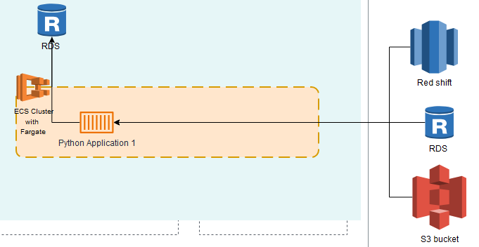

Scenario_1

We can follow below process.

https://docs.aws.amazon.com/Route53/latest/DeveloperGuide/getting-started-cloudfront-overview.html

Scenario_2

Scenario_3

[text](cost-breakdown.pdf)

Scenario_4

We can follow below process

https://docs.aws.amazon.com/glue/latest/dg/aws-glue-programming-etl-connect-bigquery-home.html